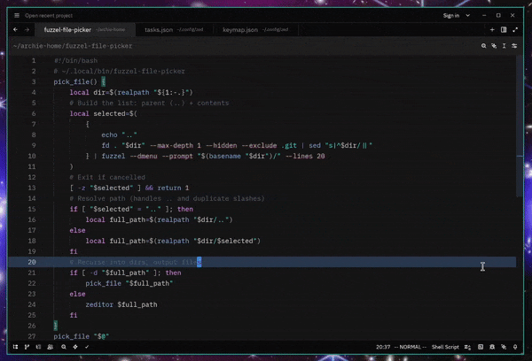

Un selector fuzzy recursivo de archivos para el editor Zed usando Fuzzel, inspirado por la navegación de dired en Emacs.

> Traducción de <a href="/project/zed-fuzzel-filepicker.html">la publicación original en inglés</a>.

**Github**: *[GCaggianese/zed-fuzzel-filepicker](https://github.com/GCaggianese/zed-fuzzel-filepicker.git)*

## Qué hace

Permite navegar y abrir archivos con búsqueda fuzzy y navegación recursiva de directorios.
Presionás el atajo, buscás archivos con fuzzy search y los abrís directamente en Zed desde dentro de Zed.

## Por qué

Cuando empecé a probar Zed, lo primero que extrañé fue el file picker de dired. Esto intenta cerrar esa brecha llevándolo a Zed.

## Demo



## Requisitos

- [Zed editor](https://zed.dev/) con la herramienta CLI `zeditor`
- [Fuzzel](https://codeberg.org/dnkl/fuzzel) (o rofi/dmenu; ver sección de adaptación)
- [fd](https://github.com/sharkdp/fd) (alternativa más rápida a `find`)
- Cualquier sistema tipo Unix

## Instalación

### 1. Instalar dependencias

```bash
# Arch
sudo pacman -S fuzzel fd zed

# Debian (zed via official install)
sudo apt install fuzzel fd-find
```

### 2. Configurar el script

```bash
# Copy script to your local bin
cp fuzzel-file-picker ~/.local/bin/
chmod +x ~/.local/bin/fuzzel-file-picker
```

### 3. Configurar Zed

**Agregar a `tasks.json`** (`~/.config/zed/tasks.json`):

```json
[
  {
    "label": "file-picker",
    "command": "~/.local/bin/fuzzel-file-picker \"${ZED_DIRNAME:-$ZED_WORKTREE_ROOT}\" > /dev/null 2>&1",
    "use_new_terminal": false,
    "reveal": "never",
    "hide": "always",
    "show_summary": false,
    "show_command": false
  }
]
```

**Agregar a `keymap.json`** (`~/.config/zed/keymap.json`):

```json
{
  "bindings": {
    "space .": ["task::Spawn", { "task_name": "file-picker" }]
  }
}
```

*(Cambiá `space .` por el atajo que prefieras.)*

## Uso

1. **Abrir Zed** en tu proyecto
2. **Presionar `Space + .`** (o tu atajo)
3. **Navegar:**
   - Escribir para buscar archivos/directorios con fuzzy search
   - Seleccionar `..` para subir un directorio
   - Seleccionar un directorio para entrar más profundo
   - Seleccionar un archivo para abrirlo en Zed
   - También se pueden crear archivos nuevos
4. **Esc para cancelar** en cualquier momento

## Cómo funciona

- Usa `fd` para listar archivos/directorios
- Fuzzel provee la interfaz fuzzy-search
- Navega recursivamente por directorios hasta que seleccionás o creás un archivo
- Abre el archivo seleccionado mediante la CLI `zeditor`

### Usar otro launcher

Supongo que se puede reemplazar `fuzzel --dmenu` por:
- **rofi:** `rofi -dmenu -p`
- **dmenu:** `dmenu -p`
- **fzf:** `fzf --prompt`

Pero todavía no lo probé.

## Integración desde Zed

Este patrón sirve para integrar **cualquier herramienta externa** con Zed mediante tasks:

1. Escribir un script que emita a stdout/stderr
2. Agregar una task a `tasks.json` con la salida redirigida
3. Asociar la task a un atajo en `keymap.json`

Está muy bueno porque permite extender Zed con facilidad.

## Troubleshooting

**"zeditor: command not found"**
- Instalar la CLI de Zed: abrir Zed -> `Cmd/Ctrl+Shift+P` -> "Install CLI"

**"fd: command not found"**
- En algunos sistemas `fd` tiene otro nombre; vas a tener que adaptar el script.

---

## Preguntas / bugs? Querés adaptarlo?

Abrí un issue o PR. Hackealo como quieras.
Si usás este patrón de integración con tasks para otras herramientas, me gustaría ver qué construís. Dejá un link en los issues o etiquetá este repo. Sería genial armar una colección de integraciones para Zed.

