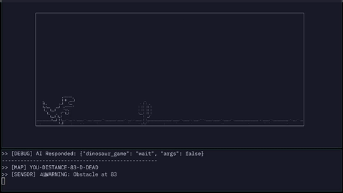
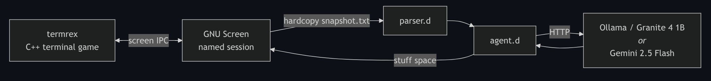

Real-time terminal game agent using GNU Screen IPC and local 1B LLM inference on CPU-only hardware.

# llmrex

> A local 1B LLM plays a terminal dinosaur game in real time through GNU Screen IPC. CPU-only. No GPU required.



**Github:** [GCaggianese/llmrex](https://github.com/GCaggianese/llmrex)

## What this is

A small framework for wiring local LLMs into terminal games as live agents.

The first target is a fork of [SATYADAHAL/termrex](https://github.com/SATYADAHAL/termrex), a C++ terminal port of the Chrome dinosaur game. The controller and parser are written in [D](https://dlang.org/). GNU Screen provides the IPC backbone, exposing both keystroke injection and live terminal-content capture.

The model can run locally through Ollama (recommended) or through a hosted backend such as Gemini 2.5 Flash.

## Why this project exists

Most "LLM agents" operate in high-latency environments with large inference budgets.

This project explores the opposite constraint:

- tight real-time loops
- CPU-only local inference
- minimal symbolic state extraction
- deterministic action serialization
- low-latency IPC between systems

The interesting problem is not the dinosaur game itself, but building a reliable real-time agent loop around a very small local model.

## Three problems the system solves

1. Capture live game state from a running terminal application
2. Inject actions back into the game in real time
3. Keep the full inference loop within a practical latency budget

## Architecture



## How it works

### GNU Screen as the IPC backbone

Named GNU Screen sessions provide exactly the two primitives needed:

* `screen -X stuff " "` injects a keystroke into the session
* `screen -X hardcopy <file>` dumps the current visible terminal content to a file

That creates a complete bidirectional channel:

* read state out
* push input back in

No custom IPC layer is needed, and the game itself does not need to expose any internal state.

Using Screen as the transport layer was the key architectural decision that made the project practical with minimal complexity.

### Slowing down the game

Community terminal ports of the dinosaur game run far too fast for practical CPU-only local inference.

The fix was to modify termrex's internal timing and physics step rate. Input handling was partially tied to the frame-refresh loop, so slowing the game also broke keypress responsiveness. The input loop had to be decoupled and partially rewritten.

Flying enemies are disabled at runtime through:

```bash
--no-obstacle-dino
```

This intentionally constrains the action space to a single binary decision:

* jump
* wait

The goal is demonstrating a stable real-time inference loop, not maximizing gameplay complexity.

### The parser: from ASCII art to symbolic state

`parser.d` extracts a single distance signal from the live terminal snapshot:

1. Find the bottom border of the game frame (`╰`)
2. Read the playfield row
3. Search for cactus signatures (`||_`, `| |`)
4. Compute the distance from the dinosaur to the nearest obstacle

The output is simply:

* a distance in characters
* or `-1` if nothing is visible

The model never sees the ASCII rendering directly.

No image processing or spatial reasoning is required.

### Why a local LLM

Hosted APIs are poorly suited for tight real-time loops:

* rate limits
* network latency
* long response times
* unpredictable inference delays

A single hosted response can take longer than multiple game obstacles.

Local inference removes those constraints entirely, but introduces a different one:

the model must be extremely small and fast.

The target hardware is:

* Intel 11th-gen i7
* 32GB DDR4
* no GPU

## Model testing results

Several models were tested through Ollama.

### IBM Granite 4 (1B quantized)

Best practical result.

* fast enough for real-time play
* reliable JSON formatting
* stable behavior under repeated loops

### Qwen reasoning variants

More capable at reasoning, but unsuitable for real time.

The model frequently entered extended reasoning sequences, turning simple actions into multi-minute pauses.

### Smaller sub-1B models

Too unreliable at generating consistent parseable output.

### Hosted backend: Gemini 2.5 Flash

Supported mainly for experimentation and comparison.

The hosted path respects API limits through enforced delays between actions.

## The "logic gate" prompt

The initial design passed raw ASCII frames directly to the model.

Small local models performed poorly at interpreting spatial layouts.

The solution was to shift most of the decision-making into deterministic preprocessing.

The parser converts obstacle distance into symbolic sensor states:

* `URGENT`
* `WARNING`
* `SAFE`

The model is then framed explicitly as a deterministic logic gate:

```text
System: You are a machine logic gate. Output ONLY JSON.
Rule 1: If SENSOR is URGENT, you must output the JUMP JSON.
Rule 2: If SENSOR is SAFE or WARNING, you must output the WAIT JSON.

Input MAP:    YOU-DISTANCE-15-D-DEAD
Input SENSOR: URGENT

JUMP JSON: {"dinosaur_game": "jump", "args": true}
WAIT JSON: {"dinosaur_game": "wait", "args": false}

Output:
```

This deliberately trades model "intelligence" for reliability.

Most of the reasoning happens in the parser layer; the model's job becomes consistent action serialization under strict latency constraints.

That trade-off is what allows a local 1B model to operate in a real-time loop on CPU-only hardware.

## Running it

### Dependencies

* Linux
* [GNU Screen](https://www.gnu.org/software/screen/)
* A D compiler (`dmd`, `ldc2`, or `gdc`)
* [Ollama](https://ollama.com/)

Optional:

* `GEMINI_API_KEY` for hosted inference

## Setup

```bash
# 1. Pull the local model
ollama pull granite4:1b

# 2. Clone this repository
git clone <REPO_URL>
cd llmrex

# 3. Build the patched termrex
cd termrex
make

# 4. Build the agent
cd ..
mkdir -p build
dmd -of=build/agent agent.d parser.d -L-lcurl
```

## Play

### Terminal A — start the game

```bash
screen -S dino
./termrex/build/termrex \
    --ascii-only \
    --no-obstacle-dino \
    --skip-intro
```

### Terminal B — run the agent

Don't forget to enable ollama
``` bash
ollama serve &
```

```bash
./build/agent \
    --ollama \
    --model granite4:1b \
    --urgent 35 # adjust the offset to match the inference delay of your setup
```

## CLI flags

* `--ollama`
  Use the local Ollama backend

* `--model <name>`
  Ollama model tag (default: `granite4:1b`)

* `--urgent <n>`
  Character distance threshold for triggering a jump

* `--dir <path>`
  Project root path for snapshot generation

## Gemini backend

Export a Gemini API key and omit `--ollama`:

```bash
export GEMINI_API_KEY=...
```

## Limitations and future work

### Hand-tuned timing

The current game speed is manually calibrated for the tested hardware and model.

A better system would:

* benchmark tokens/sec at startup
* dynamically tune game speed
* adapt inference pacing automatically

### Stateless prompts

The model receives no memory between frames.

Limited short-term context could improve prediction and timing consistency.

### Single-action gameplay

Flying enemies are disabled to keep the action space binary.

Supporting them would require:

* parser height detection
* additional sensor channels
* a second action (`duck`)

### Parser-heavy architecture

Most of the reasoning currently happens before inference.

This is intentional: it allows small models to behave reliably in real time.

More capable local models could move some decision-making back into the inference layer.

## Credits

* Upstream game: [SATYADAHAL/termrex](https://github.com/SATYADAHAL/termrex)
* Local inference: [Ollama](https://ollama.com/)
* Model: [IBM Granite](https://www.ibm.com/granite)
* Optional hosted backend: Gemini 2.5 Flash
